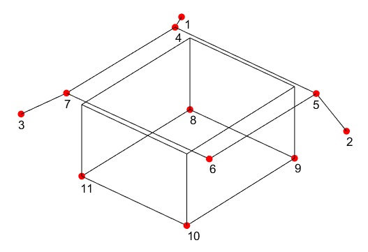

# Multi-View Triangulation

These MATLAB scripts allow to retrieve a 3D wireframe model of an object starting from a set of monocular images with associated pose through multi-view triangulation.
The code has been developed for SPEED [1] but it can be adapted with minor changes to any other dataset.

<b>Before starting</b>:
1)	Decide which object points to use
2)	Assign them a unique numeric identifier starting from 1 with step 1 (see the figure below)

  

<b>How to</b>:
1)	Download the SPEED dataset [1].
2)	Place the file train.json on the current MATLAB path.
3)	Select a set of pictures from the SPEED's “train” folder and copy them to the “selected_images” folder.
4)	Call the function “keypoints_selection” providing as arguments a vector containing the index of the selected images (end of filename) and a string for naming the output file.
5)	Type the point identifier you are going to pick and press enter.
6)	Select the point on the image and press enter.
7)	To pick another point on the same image answer “y” when asked; type “n” for moving to the next image. Press enter. (Note: it is not necessary to select all keypoints in all images, this is not recommended especially for occluded keypoints).
8)	Repeat steps 5-7 until all images have been processed.
9)	Run “model_recostruction.m”.
The average reprojection error for each keypoint is saved in the variable “errors”. When satisfied, export the variable <i>xyzPoints</i> containing the satellite model for later use.

# References

[1] Sharma, Sumant and Park, Tae Ha and D'Amico, Simone. (2019). Spacecraft Pose Estimation Dataset (SPEED). Stanford Digital Repository. Available at:
https://purl.stanford.edu/dz692fn7184. https://doi.org/10.25740/dz692fn7184
